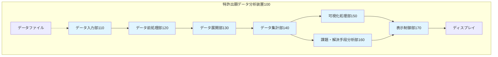
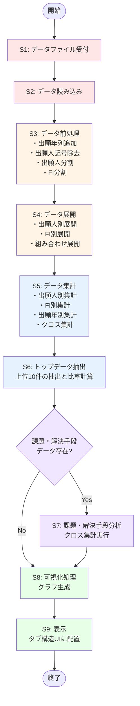

# 特許明細書 図面集

## 図1：特許出願データ分析装置の構成を示すブロック図



**図1の説明:**
- データ入力部110：CSV/Excelファイルを受け付ける
- データ前処理部120：出願年抽出、記号除去、データ分割を実行
- データ展開部130：出願人別・FI別にデータを展開
- データ集計部140：各種統計データを生成
- 可視化処理部150：グラフを生成
- 課題・解決手段分析部160：課題と解決手段の関係を分析（オプション）
- 表示制御部170：ユーザインターフェースを制御

---

## 図2：処理フローを示すフローチャート



**図2の説明:**
特許出願データ分析方法の処理フローを示す。データ入力から可視化・表示まで、ステップS1〜S9の順次処理を実行する。ステップS7では、課題・解決手段データの有無を判定し、存在する場合のみ分析を実行する。

---

## 図3：データ展開処理の例を示す図

```mermaid
graph TB
    subgraph 入力データ
        I1["レコード1<br/>出願日: 2020-01-01<br/>出願人: A社,B社<br/>FI: FI1,FI2"]
    end

    subgraph データ前処理
        P1["レコード1<br/>year: 2020<br/>applicants_list: [A社, B社]<br/>fi_list: [FI1, FI2]"]
    end

    subgraph データ展開_出願人・FI組み合わせ
        E1["レコード1-1<br/>year: 2020<br/>出願人: A社<br/>FI: FI1"]
        E2["レコード1-2<br/>year: 2020<br/>出願人: A社<br/>FI: FI2"]
        E3["レコード1-3<br/>year: 2020<br/>出願人: B社<br/>FI: FI1"]
        E4["レコード1-4<br/>year: 2020<br/>出願人: B社<br/>FI: FI2"]
    end

    I1 --> P1
    P1 --> E1
    P1 --> E2
    P1 --> E3
    P1 --> E4

    style I1 fill:#ffe6e6
    style P1 fill:#fff4e6
    style E1 fill:#e6f3ff
    style E2 fill:#e6f3ff
    style E3 fill:#e6f3ff
    style E4 fill:#e6f3ff
```

**図3の説明:**
共同出願（A社、B社）で複数のFI（FI1、FI2）が付与された1つのレコードが、データ展開処理により4つのレコードに展開される様子を示す。出願人が2人、FIが2個の場合、2×2=4レコードが生成される。

---

## 図4：ヒートマップの表示例を示す図

```
┌─────────────────────────────────────────────────────────┐
│         出願人とFIに基づく特許出願数ヒートマップ          │
├─────────────────────────────────────────────────────────┤
│                 │  G06F17/30  │  H04L29/06  │           │
│─────────────────┼─────────────┼─────────────┤           │
│     A社         │   █████ 2   │   ███ 1     │  凡例:    │
│─────────────────┼─────────────┼─────────────┤           │
│     B社         │   ███ 1     │   ███ 1     │  0   白   │
│─────────────────┼─────────────┼─────────────┤  1   薄   │
│     C社         │   ░░░ 0     │   ███ 1     │  2   濃   │
└─────────────────┴─────────────┴─────────────┴───────────┘

動的文字色調整の例:

┌──────────────┬──────────────┬──────────────┐
│              │  技術分類A   │  技術分類B   │
├──────────────┼──────────────┼──────────────┤
│  出願人X     │  ▓▓▓▓  15   │  ░░░░   2    │
│              │  (白文字)    │  (黒文字)    │
├──────────────┼──────────────┼──────────────┤
│  出願人Y     │  ▓▓▓   8    │  ▓▓▓▓  12   │
│              │  (黒文字)    │  (白文字)    │
└──────────────┴──────────────┴──────────────┘

※ 背景色の濃度が50%以上の場合は白文字、
   50%未満の場合は黒文字で表示される
```

**図4の説明:**
出願人（A社、B社、C社）とFI（G06F17/30、H04L29/06）のクロス集計結果をヒートマップとして表示した例。

上段は基本的なヒートマップを示し、各セルの色の濃さが出願件数を表す。A社のG06F17/30が値2で最も濃く、C社のG06F17/30は値0で白となる。

下段は動的文字色調整機能を示す。背景色が濃い場合（値が大きい場合）は白文字、背景色が薄い場合（値が小さい場合）は黒文字で数値を表示することにより、常に高い可読性を保つ。

---

## 図面の使用方法

### GitHubでの表示
このMarkdownファイルはGitHub上で自動的にMermaid図としてレンダリングされます。

### 画像としてエクスポート
1. **GitHub経由**: GitHubのMarkdownレンダリングをスクリーンショット
2. **Mermaid Live Editor**: https://mermaid.live/ でコードを貼り付けてエクスポート
3. **VS Code**: Mermaid拡張機能でPNG/SVGにエクスポート
4. **コマンドライン**: mermaid-cliを使用
   ```bash
   mmdc -i diagrams.md -o diagram.png
   ```

### 特許出願時の添付
- 上記方法でPNG/PDF形式に変換
- 300dpi以上の解像度を推奨
- 白黒印刷でも判読可能であることを確認
